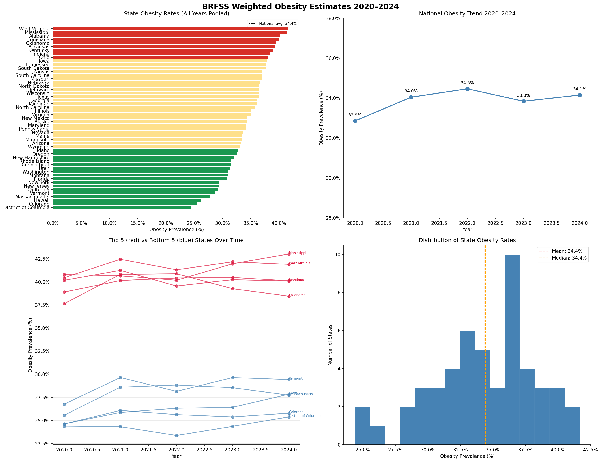
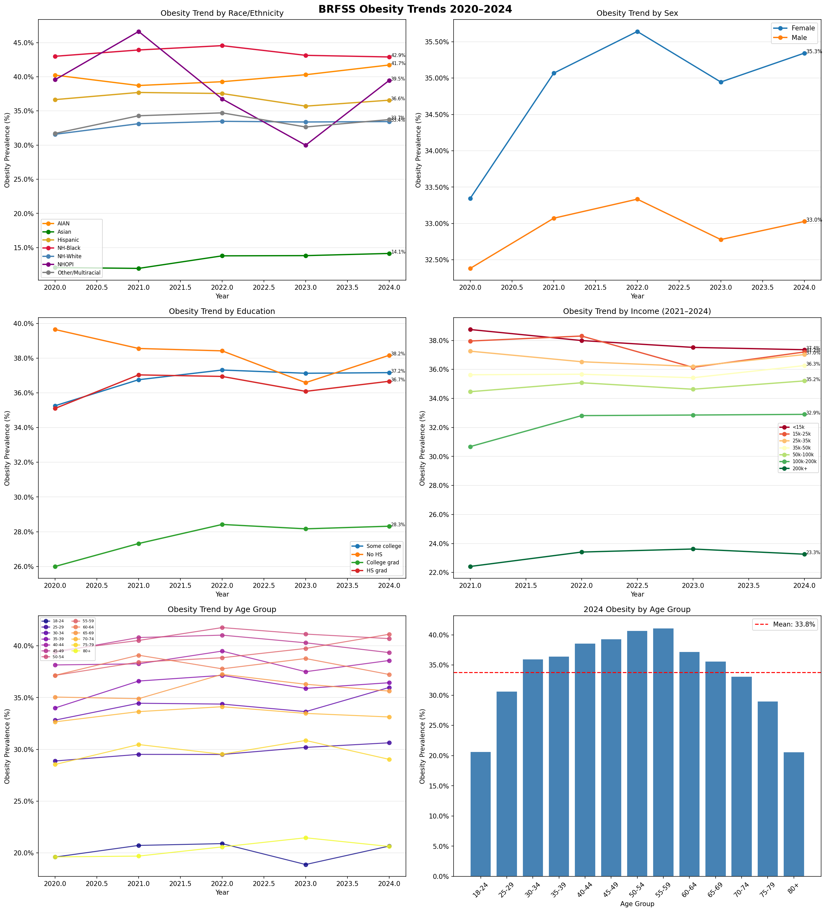
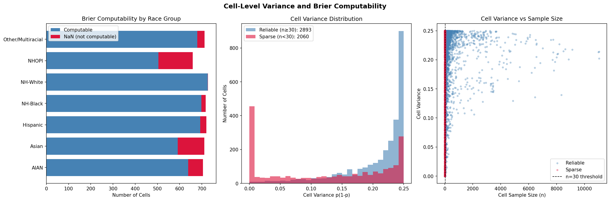

# BRFSS Final Files — Summary

## Overview
This folder contains all BRFSS preprocessing, modeling, and analysis outputs for the FSE570 capstone project. The goal is county-level obesity estimation using Multilevel Regression and Post-Stratification (MrP). BRFSS provides the outcome variable — weighted obesity rates by demographic cell — which are combined with ACS PUMS county demographic proportions for post-stratification.

---

## Dataset Access

Individual-level cleaned data is hosted on Kaggle due to file size:
[BRFSS 2020–2024 on Kaggle](https://www.kaggle.com/datasets/adiailsinghani17/brfss-2020-2024?select=brfss_clean_2020_2024.csv)

All summary files and notebooks are in this repository.

---

## Primary Files

`brfss_clean_2020_2024.csv` — Individual-level cleaned dataset. 1,622,499 respondents across 2020–2024 with harmonized race, income, and BMI variables. Hosted on Kaggle.

`brfss_group_summary_modeled.csv` — Primary input for post-stratification. 4,953 demographic cells (age × sex × race × education × income) with three obesity rate columns — raw, smoothed, and modeled — plus cell variance and Brier computability flags.

---

## Folder Structure

### notebooks
All preprocessing and analysis notebooks in order of execution:

| Notebook | Description |
|----------|-------------|
| `brfss_preprocess.ipynb` | Loads raw XPT files, harmonizes variables, computes adjusted weights, outputs clean CSV and group summary |
| `brfss_logistic_model.ipynb` | Fits weighted logistic regression on 1.32M records with state fixed effects, outputs modeled obesity rates |
| `brfss_state_estimates.ipynb` | Computes weighted state-level obesity estimates, validates against CDC rankings |
| `brfss_cell_variance.ipynb` | Computes cell-level variance and Brier computability flags |
| `brfss_designing_effect.ipynb` | Estimates design effect using Kish approximation, documents weight distribution |
| `brfss_trend_analysis.ipynb` | Computes obesity trends by race, sex, education, income, and age across 2020–2024 |

---

### state_estimates
Weighted obesity prevalence estimates at the state level, validated against CDC published rankings.

| File | Description |
|------|-------------|
| `brfss_state_estimates.csv` | Overall state obesity rates pooled across 2020–2024 |
| `brfss_state_year_estimates.csv` | State obesity rates by year |
| `brfss_national_trend.csv` | National weighted obesity rate by year |
| `brfss_state_estimates_plots.png` | Four-panel visualization |

---

### trend_analysis
Obesity trends by demographic group across 2020–2024.

| File | Description |
|------|-------------|
| `brfss_trend_by_race.csv` | Trend by race/ethnicity |
| `brfss_trend_by_sex.csv` | Trend by sex |
| `brfss_trend_by_education.csv` | Trend by education level |
| `brfss_trend_by_income.csv` | Trend by income group (2021–2024 only) |
| `brfss_trend_by_age.csv` | Trend by age group |
| `brfss_trend_plots.png` | Six-panel visualization |

---

### cell_variance
Cell-level variance and Brier computability analysis. Identifies which demographic cells will produce Brier NaN during model evaluation.

---

### design_effect
Design effect estimation using Kish approximation and weight distribution analysis.

| File | Description |
|------|-------------|
| `brfss_design_effect.csv` | DEFF estimates across methods with notes |

---

## Key Preprocessing Decisions

**Race:** Uses `_RACEPRV` (CDC recommended prevalence variable). In 2022 CDC renamed to `_RACEPR1` — harmonized under unified name. Other and Multiracial collapsed to single category for cross-year consistency. Final 7 categories: NH-White, NH-Black, AIAN, Asian, NHOPI, Other/Multiracial, Hispanic.

**Income:** 2020 `_INCOMG` (5 bins, capped at 50k+) is not comparable to 2021–2024 `_INCOMG1` (7 bins, up to 200k+). 2020 income set to NaN. Income-stratified analyses use 2021–2024 only.

**BMI:** Invalid codes (≥9000 or ≤1200) removed before calculation.

**Survey weights:** `_LLCPWT_adjusted` scales each year's weight proportionally by sample size per CDC multi-year pooling documentation. Year proportions: 2020=0.185, 2021=0.198, 2022=0.201, 2023=0.201, 2024=0.215.

**Smoothing:** Empirical Bayes shrinkage (k=30) eliminates all 419 cells with 0% or 100% obesity rates. Sparse cells (n<30) account for 41.6% of all cells.

**Modeling:** Weighted logistic regression on 1,322,240 individual records (2021–2024) with state fixed effects. AUC 0.634. Modeled std dev 0.117 vs 0.096 for smoothing.

---

## Variable Reference

| Variable | Description |
|----------|-------------|
| `_STATE` | State FIPS code |
| `_LLCPWT` | Original CDC survey weight |
| `_LLCPWT_adjusted` | Multi-year adjusted weight per CDC documentation |
| `_STSTR` | Stratification variable for complex sampling |
| `_PSU` | Primary sampling unit for complex sampling |
| `_BMI5` | Raw BMI (integer × 100) |
| `BMI` | Calculated BMI (_BMI5 / 100) |
| `obese` | Binary obesity indicator (1 if BMI ≥ 30) |
| `_AGEG5YR` | Age group (codes 1–13, ages 18–80+) |
| `_SEX` | Sex (1=Male, 2=Female) |
| `_EDUCAG` | Education level (4 categories) |
| `_INCOMG1` | Income group (7 categories, NaN for 2020) |
| `_RACEPRV` | Race/ethnicity (7 categories, harmonized) |
| `year` | Survey year (2020–2024) |
