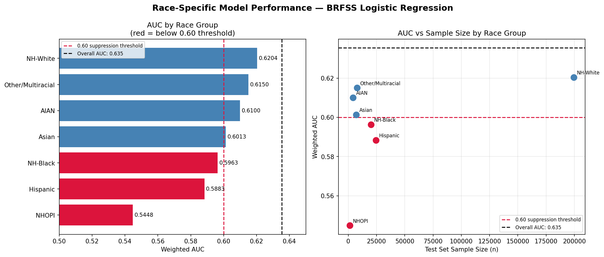
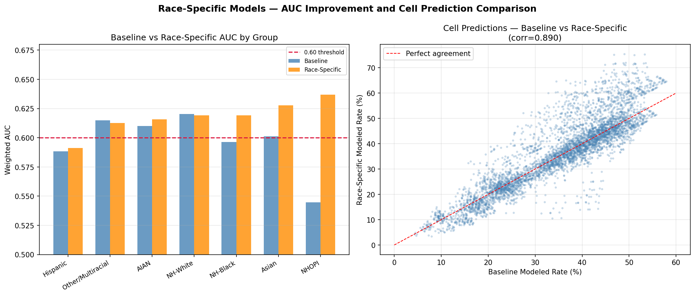

# Race-Specific Model Analysis

## Overview
This folder contains the full investigation into race-specific model performance
and attempts to address low AUC for minority racial groups. The work progressed
through three stages — baseline AUC diagnosis, interaction model experiment,
and race-specific model solution.

---

## Notebooks

| Notebook | Description |
|----------|-------------|
| `brfss_race_auc.ipynb` | Computes baseline AUC separately for each racial group to identify which groups fall below the 0.60 suppression threshold |
| `brfss_interaction_model.ipynb` | Adds Age×Race, Income×Race, and Education×Race interaction terms to the baseline model to improve within-group prediction |
| `brfss_race_specific_models.ipynb` | Trains a separate logistic regression for each racial group and generates race-specific cell predictions |

---

## Files

| File | Description |
|------|-------------|
| `brfss_race_auc.csv` | Baseline AUC, sample size, and obesity rate per racial group |
| `brfss_race_auc_plots.png` | AUC by race bar chart and AUC vs sample size scatter |
| `brfss_group_summary_race_models.csv` | Full group summary with additional `obesity_rate_race_model` column from race-specific models |
| `brfss_race_specific_model_plots.png` | Baseline vs race-specific AUC comparison and cell prediction scatter |

---

## Investigation Summary

### Stage 1 — Baseline AUC Diagnosis
Three racial groups fell below the 0.60 suppression threshold in the baseline
logistic regression trained on all groups combined:

| Race Group | AUC | Flag |
|------------|-----|------|
| NHOPI | 0.5448 | ⚠️ LOW |
| Hispanic | 0.5883 | ⚠️ LOW |
| NH-Black | 0.5963 | ⚠️ LOW |

NH-White dominated the combined model with 75% of observations (997,964 respondents),
suppressing the model's ability to learn demographic patterns specific to minority groups.

---

### Stage 2 — Interaction Model
Added 126 interaction terms (Age×Race, Income×Race, Education×Race) to the baseline
81 features — total 207 features.

| Race Group | Baseline | Interactions | Change |
|------------|----------|--------------|--------|
| Asian | 0.6013 | 0.6156 | +0.0143 ⬆️ |
| NHOPI | 0.5448 | 0.5552 | +0.0104 ⬆️ |
| NH-Black | 0.5963 | 0.6008 | +0.0045 ⬆️ |
| Hispanic | 0.5883 | 0.5905 | +0.0022 ➡️ |

NH-Black crossed the threshold. Hispanic and NHOPI remained below 0.60.
Overall AUC improvement was only +0.0015 — too small to justify replacing
the existing group summary file.

---

### Stage 3 — Race-Specific Models
Trained a separate logistic regression for each racial group using only that
group's respondents. Same features as baseline — age, sex, education, income,
state fixed effects.

| Race Group | n | Baseline | Race-Specific | Change |
|------------|---|----------|---------------|--------|
| NHOPI | 6,646 | 0.5448 | 0.6369 | +0.0921 ⬆️ |
| Asian | 35,418 | 0.6013 | 0.6277 | +0.0264 ⬆️ |
| NH-Black | 100,433 | 0.5963 | 0.6193 | +0.0230 ⬆️ |
| AIAN | 21,173 | 0.6100 | 0.6157 | +0.0057 ⬆️ |
| Hispanic | 121,793 | 0.5883 | 0.5913 | +0.0030 ➡️ |
| NH-White | 997,964 | 0.6204 | 0.6191 | -0.0013 ➡️ |
| Other/Multiracial | 38,813 | 0.6150 | 0.6126 | -0.0024 ➡️ |

---

## Key Conclusions

**NHOPI, Asian, and NH-Black benefit significantly from race-specific models.**
Removing NH-White dominance allows each model to learn group-specific demographic
patterns. NHOPI improved by +0.092 — the largest gain — confirming the baseline
model was severely underutilizing the available NHOPI signal.

**Hispanic remains below 0.60 regardless of modeling approach.**
With 121,793 respondents and a dedicated model, Hispanic AUC only reached 0.591.
This is a structural data limitation — demographics alone do not adequately explain
within-group obesity variation for Hispanic populations. Cultural, geographic, and
community-level factors not captured in BRFSS drive the remaining variation.

**Race-specific cell predictions are available in `brfss_group_summary_race_models.csv`.**
The `obesity_rate_race_model` column provides an alternative to `obesity_rate_modeled`
for post-stratification. Cell predictions are highly correlated with the baseline
(r=0.890) but show more variation (std dev 0.141 vs 0.117) and better capture
minority group demographic patterns.

---

## Suppression Recommendation
Counties where the Hispanic population exceeds 50% should have obesity estimates
flagged as unreliable. No modeling approach tested was able to bring Hispanic AUC
above 0.60 — demographics do not adequately predict within-group obesity variation
for this population.

---

## Primary Output File
`brfss_group_summary_race_models.csv` — 4,953 cells × 15 columns. Use
`obesity_rate_race_model` for post-stratification, particularly for NHOPI,
Asian, and NH-Black cells where race-specific AUC improvements are largest.
